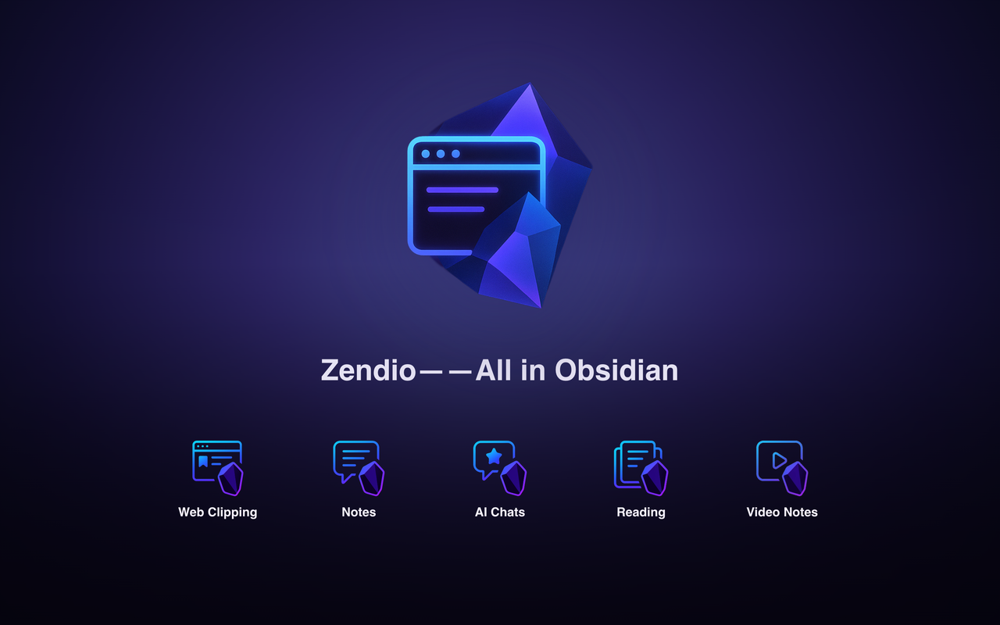

[中文](README.zh-CN.md)｜[日本語](README.ja-JP.md)

<p align="center">
  
</p>

## Introduction | What & Why

- **One-line pitch**: Zendio is a browser extension that captures web pages, highlights, comments, and AI chats into structured Markdown notes.
- **Problems we solve**:
  - Stop copying & pasting web or conversation content by hand
  - Preserve context, annotations, and source links so insights never get lost
  - Auto-create YAML / Properties tailor-made for Obsidian Bases and [Sidebar Highlights](https://github.com/trevware/obsidian-sidebar-highlights)
- **Who benefits**: researchers, engineers, writers, knowledge workers, and heavy Obsidian users

## Latest Enhancements

- ♿ Clipper dialog now ships with focus trap, screen reader labels, and Alt+Arrow keyboard nudging for precise placement.
- 🌐 Options screen rebuilt with modular components, custom confirmation dialogs, and full i18n coverage across 12 human UI languages.
- 🤖 AI chat parser modularization adds first-class support for Tongyi, DeepSeek, and Kimi while keeping ChatGPT/Claude/Copilot/Gemini reliable.
- 📌 Fragment context capture handles nested lists, Shadow DOM, and Text Fragments to keep surrounding insights intact.
- 🔐 Obsidian REST writer hardens retries, masks API keys in logs, and auto-falls back between HTTPS/HTTP endpoints.

## Feature Highlights

### 📑 Web Clipping

- Right-click to save any selection or full article
- Extract title, URL, author, capture timestamp, and more metadata
- Clean article body with Mozilla Readability while keeping checklists, code blocks, math, and tables
- Generate Text Fragment URLs for one-click jumps back to the original paragraph

### 💬 Fragment Comments

- Annotate clips directly inside the floating panel to capture your thinking in the moment
- Display annotations alongside the source text in structured Markdown
- Timestamp-driven filenames prevent overwriting repeated clips from the same page
- Keyboard-friendly focus trap keeps the dialog accessible; use `Alt` + arrow keys for pixel-perfect positioning

### 🤖 AI Assistance

- Generate titles, summaries, and tags via OpenAI, Ollama, local WebLLM, and other compatible models
- Support for ChatGPT, Claude, Gemini, Copilot, Perplexity, Tongyi Qianwen, DeepSeek, Kimi, and more
- Modular platform parsers strip UI noise per site, making future platform support faster to add
- Strip platform noise (Claude thinking blocks, Copilot reaction bars, etc.) while preserving formatting

### 📚 Reading Sessions

- Merge multiple fragments into a single “reading note,” even across different pages
- Session timeline captures how you read long pieces or research threads
- Combine AI conversations and article clips to build richer knowledge chains

### 🗂️ Multi-Vault Smart Routing

- Configure multiple Obsidian vaults and route content with domain, keyword, or URL rules
- Customize rule priority, fallbacks, and notifications so every clip lands in the right vault
- Redesigned options builder introduces localized modal flows and safer previews for rule changes

### 🔗 [Sidebar Highlights](https://github.com/trevware/obsidian-sidebar-highlights) Compatibility

- Export highlights with the fields [Sidebar Highlights](https://github.com/trevware/obsidian-sidebar-highlights) expects for flashcards and review workflows
- YAML frontmatter works out of the box with Bases, Dataview, and similar plugins

### 🌍 Localization & Customization

- UI available in English, Simplified Chinese, Japanese, German, French, Spanish (Spain), Spanish (Latin America), Italian, Korean, Portuguese (Brazil), Russian, and Traditional Chinese with instant switching
- Tailor path templates, content templates, and Markdown rules to fit any workflow

## Install & Setup

1. **Install the Chrome extension**  
   Development build only for now—download the repository and load the `dist/` directory in Chrome Developer Mode. (Store link coming soon.)
2. **Configure the [Obsidian Local REST API](https://github.com/coddingtonbear/obsidian-local-rest-api)**
   - Install the [Local REST API](https://github.com/coddingtonbear/obsidian-local-rest-api) plugin inside Obsidian
   - Enable the plugin, set an API key, and confirm the endpoint (default `https://127.0.0.1:27124`)
3. **Finish extension setup**
   - Right-click the extension icon → Options
   - Provide vault paths, REST API settings, and AI API keys
   - Optional in Chromium browsers: choose a local Vault folder for File System Access writes. If permission is missing, denied, unsupported, or preflight fails, the extension falls back to REST when REST is configured.
   - Define routing rules and templates (Article / Fragment / AI Chat / Reading Session)

## Development Baseline

- Recommended Node.js: `20.20.2` (`.nvmrc`); package engines allow `>=20.19 <21`
- Recommended npm: `10.8.2`; package engines allow `>=10 <11`
- `npm run test*` and `npm run visual*` entrypoints run `verify:runtime` first, so unsupported local Node versions fail before Vitest or Playwright starts.
- Minimum preflight gate before large refactors:
  - `npm run verify:preflight`
  - `npm run test:e2e:browser`
  - `npm run test:e2e:browser:smoke`

### Permission Breakdown

| Permission                                | Purpose                                                                                          | Privacy Promise                                           |
| ----------------------------------------- | ------------------------------------------------------------------------------------------------ | --------------------------------------------------------- |
| `activeTab`                               | Read the page content you clip                                                                   | Triggered only when you clip; never sent to third parties |
| `scripting`                               | Inject content scripts for the floating panel and annotations                                    | Fully open source and auditable                           |
| `storage`                                 | Persist extension settings, routing rules, and pending tasks                                     | Data stays local in your browser                          |
| `contextMenus`                            | Add the “Save to Obsidian” right-click entry                                                     | No history tracking—only used on demand                   |
| `notifications`                           | Show completion toasts after clipping                                                            | No external calls; notifications vanish instantly         |
| `downloads`                               | Save generated package/export artifacts when explicitly requested                                | User-triggered only                                       |
| `offscreen`                               | In Chrome, host the File System Access bridge for optional local Vault folder writes             | Used only after you choose a local folder                 |
| `host_permissions: <all_urls>`            | Allow clipping on any page                                                                       | Access occurs only when you trigger a clip                |
| `host_permissions: http(s)://127.0.0.1/*` | Talk to the [Obsidian Local REST API](https://github.com/coddingtonbear/obsidian-local-rest-api) | Communicates solely with your local Obsidian instance     |

Local folder access is optional and Chromium-only. The extension cannot write to arbitrary local paths: you must explicitly choose a folder, writes are scoped to that browser-granted handle, and you can clear the folder from Options. Firefox currently uses the REST path for Vault writes.

## Quick Start Guide

### Fast workflow

1. Select text → right-click → `Save to Obsidian`
2. Add comments, tags, or vault routing inside the floating panel
3. Wrap up reading, open the extension panel, and compile fragments into a reading session note
4. Open Obsidian to find the Markdown file with metadata and attachments already in place

### YAML template examples

**Article**

```markdown
---
type: article
title: 'Reading Note Title'
url: 'https://example.com'
author: 'Author'
clipped_at: '2024-01-01T12:00:00'
tags: [clipping]
---

Article body goes here...
```

**Fragment**

```markdown
---
type: fragment
source_title: 'Original Page Title'
source_url: 'https://example.com#~:text=fragment'
comment: 'My annotation'
clipped_at: '2024-01-01T12:05:00'
route: 'Research Vault'
---

> Highlighted text from the page
```

**AI Chat**

```markdown
---
type: ai-chat
platform: 'ChatGPT'
model: 'gpt-4o'
started_at: '2024-01-01T13:00:00'
tags: [ai, research]
---

### user

Please summarise recent progress on the paper.

### assistant

Here are the key points...
```

**Reading Session**

```markdown
---
type: reading-session
sources:
  - title: 'Article A'
    url: 'https://example.com/a'
  - title: 'Fragment B'
    url: 'https://example.com/b#fragment'
compiled_at: '2024-01-01T14:00:00'
---

1. First reading pass...
2. Second insight...
```

### Screenshot placeholders

- Floating panel, Bases table view, and other visuals to be added in upcoming releases.

## Roadmap

- ✅ Shipped: web clipping, fragment annotations, AI chat export, reading sessions, multi-vault routing, multilingual UI, accessible clipper dialog, modular AI chat parsers
- 🚧 In progress: advanced template manager, broader AI model support, replayable reading timelines, vault-wide analytics & batch cleanup tools
- 💡 Ideas welcome—open an Issue or PR to share your workflow

## Support The Project

- [Buy me a coffee on Ko-fi](https://ko-fi.com/xiannian)
- [Support via Afdian (爱发电)](https://afdian.com/a/LefShi)

## Credits & License

- Inspiration: [Readwise](https://github.com/readwiseio/obsidian-readwise), [Sidebar Highlights](https://github.com/trevware/obsidian-sidebar-highlights), [Dataview](https://github.com/blacksmithgu/obsidian-dataview), [Obsidian Bases](https://github.com/hadynz/obsidian-bases)
- Third-party components: [AI Chat Exporter](https://github.com/revivalstack/chatgpt-exporter), [Obsidian Web Clipper](https://github.com/obsidianmd/obsidian-clipper), [Mozilla Readability](https://github.com/mozilla/readability), [Turndown](https://github.com/mixmark-io/turndown)
- License: MIT (see `LICENSE`)
- Authors: Zendio team — reach out via Issues, PRs, or Discussions

---

Make knowledge management simple. Keep deep thinking effortless. 🧠✨
