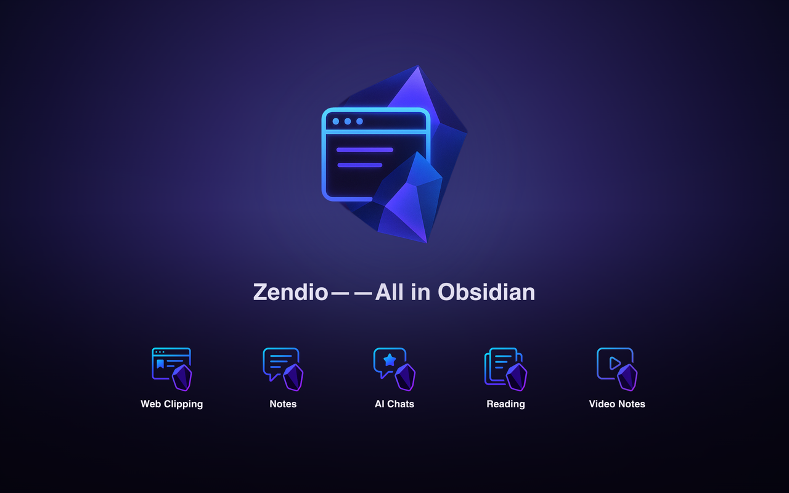

[English](README.md) | [日本語](README.ja-JP.md)

<p align="center">
  
</p>

## 安装 Zendio

[产品网站](https://zendio.sxnian.com/) · [GitHub Releases](https://github.com/Lefeaker/zendio/releases) · [反馈问题](https://github.com/Lefeaker/zendio/issues)

| 浏览器          | 商店入口                                                                                                     | 上架状态                                  |
| --------------- | ------------------------------------------------------------------------------------------------------------ | ----------------------------------------- |
| Google Chrome   | [从 Chrome 应用商店安装](https://chromewebstore.google.com/detail/eoohmbhdepgknfemajanfaejmonckgmo)          | v0.3.1 已上架。                           |
| Mozilla Firefox | [从 Firefox 附加组件商店安装](https://addons.mozilla.org/firefox/addon/zendio/)                              | v0.3.1 已上架。                           |
| Microsoft Edge  | [Microsoft Edge Add-ons](https://microsoftedge.microsoft.com/addons/detail/oogaldhpamhgeeloehndhcgjkijkbocm) | v0.3.1 待上架；审核通过后详情页链接可用。 |

商店状态核对于 **2026 年 9 月 13 日**。各商店独立审核，实际提供的版本可能与当前源码版本 **v0.3.1** 不同。

## v0.3.1 更新

- YouTube / 哔哩哔哩标题延迟加载或修改后，视频笔记的标题和文件名会同步更新。
- 下载、本地目录和 REST 保存使用同一个当前标题；切换视频不再沿用旧标题，读取恢复数据失败时保留已有页面标题。
- 新增 Microsoft Edge 独立安装包，与 Chrome、Firefox 保持一致的功能体验。
- 设置页的分段控件适配长翻译和窄窗口；高亮颜色采用紧凑色块，并显示当前颜色名称。

## 简介

- **一句话定位**：Zendio 是一款面向 Obsidian 工作流的浏览器扩展，用于把网页、片段、阅读会话、视频笔记和 AI 对话保存为结构化 Markdown。
- **解决的问题**：
  - 减少在网页、视频和对话之间反复复制粘贴
  - 连同来源链接、批注、时间戳、截图和 YAML 元数据一起保存
  - 通过路由规则、路径模板和 YAML 字段适配 Obsidian Bases、Dataview 与 [Sidebar Highlights](https://github.com/trevware/obsidian-sidebar-highlights)
- **适合谁**：研究者、工程师、写作者、知识管理者和重度 Obsidian 用户。

## 当前能力

- 设置与首次引导支持 12 种语言、亮色 / 暗色 / 跟随系统主题，以及自适应控件。
- Chrome 和 Edge 可以直接写入你选择的本地目录。仅绑定本地目录即可作为可用仓库，无需填写 REST URL 或 API 密钥；Firefox 通过 Obsidian Local REST API 直接写入仓库。
- 不连接仓库也可以下载 Markdown 文件。
- 视频模式支持 YouTube 与哔哩哔哩时间戳笔记、文本片段捕捉、截图状态圆点和导出时的截图附件。
- 阅读和视频草稿支持最近 48 小时内、最新 5 个页面、每页 20 条可恢复内容的自动恢复。
- 文章、视频、片段、阅读会话和 AI 对话都拥有独立路径模板与 YAML 预览行为。
- 支持、提出建议、联系作者、更新日志、使用协议和隐私政策入口在选项页和首次引导页保持一致。

## 功能清单

### 网页剪藏

- 右键保存选中文本或整篇文章。
- 自动提取标题、URL、作者、捕获时间等元数据。
- 基于 Mozilla Readability 清洗正文，并保留任务列表、代码块、数学公式和表格。
- 生成 Text Fragment URL，便于一键回到原文位置。

### 片段评论

- 在剪藏浮窗内即时添加批注。
- 评论与原文片段一起保存为结构化 Markdown。
- 多次剪藏同一页面时使用时间戳命名，避免覆盖。
- 焦点管理支持键盘操作，减少鼠标依赖。

### 阅读会话

- 将一个或多个页面的片段合并为一篇阅读笔记。
- 保留阅读顺序、来源页面和批注。
- 在保留窗口内重新打开浏览器或页面时恢复未保存草稿。

### 视频笔记

- 在支持的 YouTube 与哔哩哔哩页面捕捉时间戳笔记。
- 保存评论、字幕或选中文本片段，并保留回跳链接。
- 用圆点标记每个时间戳是否已有截图；点击圆点即可切换截图状态。
- 导出截图附件，并支持单独配置附件目录、文件名和 Markdown URL。
- 视频笔记拥有独立的视频路径模板，不再复用文章或片段路径。

### AI 对话捕捉

- 支持导出 ChatGPT、Claude、Gemini、Copilot、Perplexity、通义千问、DeepSeek、Kimi 等平台的对话。
- 剥离平台界面噪音和反应条，同时保留对话结构与格式。
- 可选元数据能力只使用用户自己配置的提供方；基础剪藏和导出不依赖任何模型提供方。

### 多仓库路由

- 配置多个 Obsidian Vault 目标。
- 通过域名、关键词、URL、优先级和回退规则分流内容。
- 在选项页测试连接，并通过配置诊断修复缺失字段。

### YAML 与模板控制

- 为文章、视频、片段、阅读会话和 AI 对话分别配置保存路径。
- 按内容类型配置 YAML 字段，并支持域名级映射规则。
- YAML 预览根据当前编辑状态和当前内容类型生成。

### 多语言

- 发布界面语言包括 English、简体中文、繁體中文、日本語、Deutsch、Français、Español、Español latinoamericano、Italiano、한국어、Português brasileiro 和 Русский。
- 语言选择菜单使用各语言自己的名称显示。

## 安装与配置

1. **从商店安装**：使用上方入口安装，然后打开 Zendio 的选项页。
2. **选择保存位置**：
   - **Chrome / Edge 本地目录**：选择 Obsidian 仓库目录并授予访问权限。只使用本地目录时，REST URL 和 API 密钥可以留空。
   - **Obsidian Local REST API**：安装 [Obsidian 插件](https://github.com/coddingtonbear/obsidian-local-rest-api)，配置其地址和 API 密钥。这是 Firefox 直接写入仓库的方式，也可用于 Chrome / Edge。
   - **下载**：无需连接 Obsidian 或配置仓库，即可保存 Markdown。
3. **完成个性化设置**：选择语言和主题，再按需配置仓库路由、文件路径、YAML 字段、截图附件和模型提供方；检查可选的使用统计与错误诊断开关。

手动安装时，请使用已公开的 [GitHub Release](https://github.com/Lefeaker/zendio/releases) 所附的对应浏览器安装包。Chrome / Edge 的 ZIP 需要先解压，再在 `chrome://extensions` 或 `edge://extensions` 开启开发者模式并加载该目录。Firefox 需要已签名的 XPI，推荐直接从商店安装。GitHub 自动生成的 **Source code** 源码压缩包不能直接作为扩展安装。

从源码构建请遵循[工程指南](docs/engineering-entrypoints.md)中的固定环境与命令；[Edge 构建说明](docs/engineering-entrypoints.md#microsoft-edge-distribution)也在其中。

## 开发基线

- Node.js：`.nvmrc` 固定为 `20.20.2`；package engines 允许 `>=20.19 <21`。
- npm：当前验证版本为 `10.8.2`；package engines 允许 `>=10 <11`。
- `npm run test*` 与 `npm run visual*` 入口会先执行 `verify:runtime`。
- 常用本地门禁：
  - `npm run quality`
  - `npm run verify:preflight`
  - `npm run verify:stitch-secondary`
  - `npm run build`

## 权限说明

| 权限                                      | 用途                                                                                      | 隐私边界                         |
| ----------------------------------------- | ----------------------------------------------------------------------------------------- | -------------------------------- |
| `activeTab`                               | 读取用户主动剪藏的页面内容                                                                | 仅在触发剪藏时使用               |
| `scripting`                               | 注入剪藏、阅读、视频和支持界面的内容脚本                                                  | 运行时代码开源可审查             |
| `storage`                                 | 保存设置、路由规则、本地 ID 和近期可恢复草稿                                              | 保存在浏览器扩展环境中           |
| `contextMenus`                            | 添加右键保存入口                                                                          | 不跟踪浏览历史                   |
| `notifications`                           | 显示完成或失败通知                                                                        | 仅本地可见                       |
| `downloads`                               | 用户请求时保存降级或导出文件                                                              | 只由用户操作触发                 |
| `offscreen`                               | 承载 Chromium 本地目录桥接和截图处理支持                                                  | 只用于浏览器支持的本地操作       |
| `host_permissions: <all_urls>`            | 在用户主动操作的页面上启用剪藏                                                            | 页面访问绑定到用户触发的捕捉流程 |
| `host_permissions: http(s)://127.0.0.1/*` | 调用 [Obsidian Local REST API](https://github.com/coddingtonbear/obsidian-local-rest-api) | 只与本机 Obsidian REST 端点通信  |

本地目录访问是可选的，并且仅适用于 Chromium。Zendio 不能写入任意本地路径：用户必须显式选择目录，写入范围受浏览器授予的目录句柄限制，也可以在选项页清除。

## 快速开始

1. 选中文本，右键选择 Zendio 保存入口。
2. 在浮窗中添加评论、标签或目标仓库。
3. 视频页面可通过 Zendio 视频面板添加时间戳笔记和截图状态。
4. 结束阅读或视频会话后导出 Markdown 笔记和附件。
5. 在 Obsidian 中检查保存的笔记、YAML 元数据和关联资源。

## YAML 示例

**文章**

```markdown
---
type: article
title: '阅读笔记标题'
url: 'https://example.com'
author: '作者'
clipped_at: '2026-06-20T12:00:00'
tags: [clipping]
---

正文内容...
```

**视频**

```markdown
---
type: video
platform: 'Bilibili'
title: '视频笔记标题'
url: 'https://www.bilibili.com/video/example'
clipped_at: '2026-06-20T12:05:00'
tags: [video]
---

## 00:42

- 这一时间点的笔记
- 截图：`./assets/video-note-0042.png`
```

**片段**

```markdown
---
type: fragment
source_title: '原网页标题'
source_url: 'https://example.com#~:text=fragment'
comment: '我的批注'
clipped_at: '2026-06-20T12:10:00'
route: 'Research Vault'
---

> 选中的原文片段
```

**AI 对话**

```markdown
---
type: ai-chat
platform: 'ChatGPT'
started_at: '2026-06-20T13:00:00'
tags: [conversation, research]
---

### user

请帮我总结最近的论文进展。

### assistant

关键要点如下...
```

**阅读会话**

```markdown
---
type: reading-session
sources:
  - title: '文章 A'
    url: 'https://example.com/a'
  - title: '片段 B'
    url: 'https://example.com/b#fragment'
compiled_at: '2026-06-20T14:00:00'
---

1. 第一阶段阅读记录...
2. 第二阶段洞见...
```

## 支持与反馈

- 官网：[zendio.sxnian.com](https://zendio.sxnian.com/)
- Ko-fi：[ko-fi.com/xiannian](https://ko-fi.com/xiannian)
- 微信赞赏：可在 Zendio 的“支持”弹窗中查看
- 反馈：[GitHub Issues](https://github.com/Lefeaker/zendio/issues)、[Reddit](https://www.reddit.com/user/sxnian/) 或 [邮件](mailto:zendio@sxnian.com)

## 致谢与许可

- 灵感来源：[Readwise](https://github.com/readwiseio/obsidian-readwise)、[Sidebar Highlights](https://github.com/trevware/obsidian-sidebar-highlights)、[Dataview](https://github.com/blacksmithgu/obsidian-dataview)、[Obsidian Bases](https://github.com/hadynz/obsidian-bases)
- 第三方组件：[AI Chat Exporter](https://github.com/revivalstack/chatgpt-exporter)、[Obsidian Web Clipper](https://github.com/obsidianmd/obsidian-clipper)、[Mozilla Readability](https://github.com/mozilla/readability)、[Turndown](https://github.com/mixmark-io/turndown)
- License：MIT，详见 `LICENSE`。
- 联系方式：[作者个人网站](https://zendio.sxnian.com/)、[GitHub](https://github.com/Lefeaker/zendio)、[Reddit](https://www.reddit.com/user/sxnian/) 或 [zendio@sxnian.com](mailto:zendio@sxnian.com)
