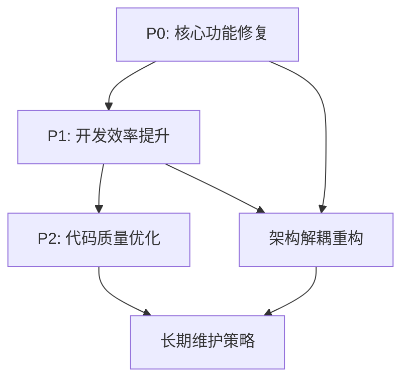
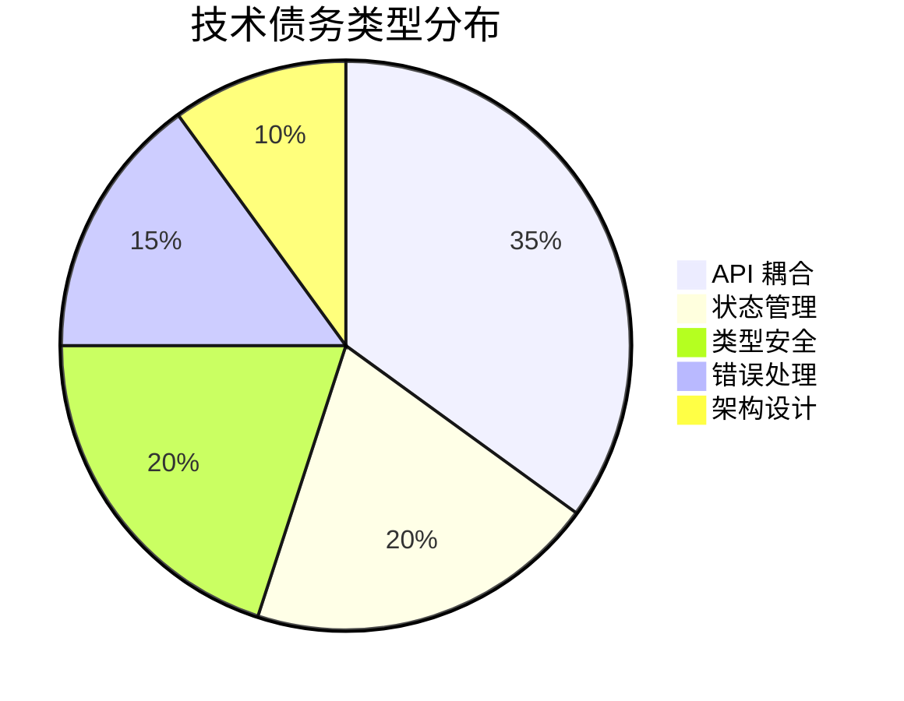
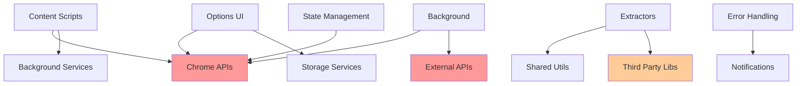
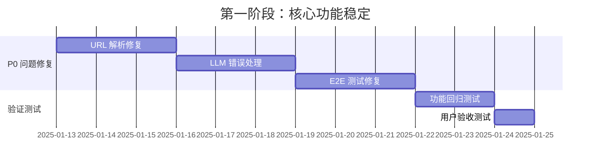
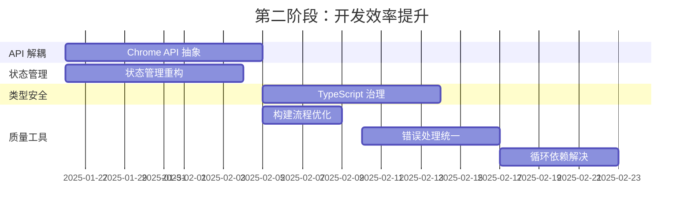
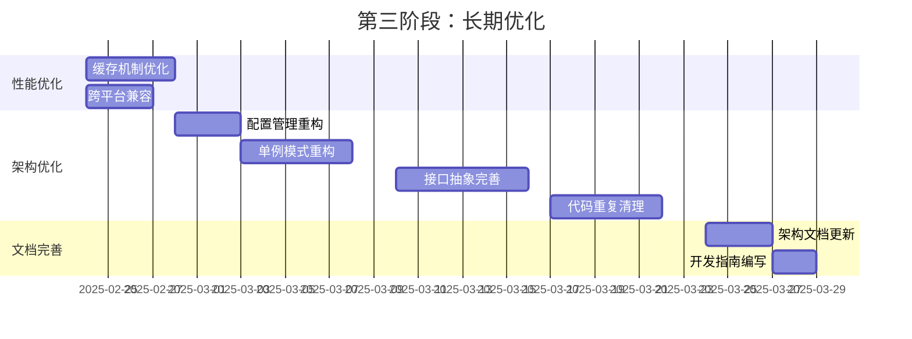

# AiiinOB 技术债务与耦合分析报告

**文档版本**: v1.0  
**创建日期**: 2025-01-13  
**作者**: AI 代码分析助手  
**项目版本**: v0.2.0  

---

## 📋 目录

1. [执行摘要](#执行摘要)
2. [分析方法](#分析方法)
3. [技术债务分类](#技术债务分类)
4. [P0 级别：立即处理](#p0-级别立即处理)
5. [P1 级别：影响开发效率](#p1-级别影响开发效率)
6. [P2 级别：优化改进](#p2-级别优化改进)
7. [架构耦合问题](#架构耦合问题)
8. [解耦路线图](#解耦路线图)
9. [风险评估](#风险评估)
10. [参考资料](#参考资料)

---

## 🎯 执行摘要

### 总体评估

AiiinOB 项目作为一个功能丰富的浏览器扩展，在快速迭代过程中积累了一定的技术债务。通过深入代码分析，发现了 **15 个主要技术债务项**，其中：

- **P0 级别（立即处理）**: 3 个
- **P1 级别（影响开发效率）**: 6 个  
- **P2 级别（优化改进）**: 6 个

### 关键发现

1. **Chrome API 直接耦合严重**：在 25+ 个文件中直接使用 `chrome.*` API
2. **全局状态管理混乱**：多个模块维护独立的缓存状态
3. **循环依赖风险**：提取器模块间存在潜在循环依赖
4. **类型安全缺失**：大量 `any` 类型和隐式类型推断
5. **错误处理不统一**：各模块错误处理策略不一致

### 修复优先级



---

## 🔍 分析方法

### 代码扫描范围

- **源代码文件**: 104 个 TypeScript/JavaScript 文件
- **代码行数**: ~15,947 行（不含注释和空行约 12,000 行）
- **模块分析**: Background、Content、Options、Shared 四大模块
- **依赖关系**: 通过 import/export 分析模块间耦合

### 分析工具

- 静态代码分析：grep 搜索模式匹配
- 依赖关系分析：import 路径追踪
- API 使用统计：Chrome API 调用频次
- 类型覆盖率：TypeScript 类型使用情况

---

## 📊 技术债务分类

### 债务严重程度定义

| 级别 | 定义 | 影响范围 | 修复紧急度 |
|------|------|----------|------------|
| P0 | 影响核心功能，可能导致功能完全失效 | 用户体验 | 立即处理 |
| P1 | 影响开发效率和代码质量 | 开发团队 | 1-2 周内 |
| P2 | 代码优化和长期维护 | 项目健康度 | 1-2 月内 |

### 债务类型分布



---

## 🚨 P0 级别：立即处理

### P0-1: 文章提取器 URL 解析崩溃

**严重程度**: 🔴 P0 - 立即处理  
**影响范围**: 核心剪藏功能  
**发现位置**: `src/content/extractors/articleExtractor.ts:35-50`

#### 问题描述

当页面 URL 无法被 `new URL()` 解析时（如 `about:blank`、阅读模式页面），会导致剪藏功能完全失效。

#### 当前代码问题

```typescript
// src/content/extractors/articleExtractor.ts:35-50
export async function extractArticle(doc: Document, url: string) {
  const cloned = preprocessDocument(doc.cloneNode(true) as Document, url);
  const baseUrl = tryParseUrl(url, doc.baseURI ?? undefined);  // 可能返回 undefined
  const rd = new Readability(cloned).parse();

  // ... 后续代码假设 baseUrl 存在
  if (baseUrl) {
    try {
      abs = new URL(src, baseUrl.href).href;  // 如果 baseUrl 为 undefined 会崩溃
    } catch {
      abs = src;
    }
  }
}
```

#### 根因分析

1. `tryParseUrl` 函数在 URL 解析失败时返回 `undefined`
2. 后续代码没有充分处理 `baseUrl` 为空的情况
3. 特殊协议（`about:`、`chrome-extension:`）没有白名单处理

#### 解耦方案

```typescript
// 建议的重构代码
interface UrlContext {
  href: string;
  hostname: string;
  isValid: boolean;
}

function createUrlContext(rawUrl: string, fallback?: string): UrlContext {
  const SAFE_PROTOCOLS = ['http:', 'https:', 'file:'];
  
  for (const candidate of [rawUrl, fallback, 'about:blank'].filter(Boolean)) {
    try {
      const parsed = new URL(candidate);
      return {
        href: parsed.href,
        hostname: parsed.hostname,
        isValid: SAFE_PROTOCOLS.includes(parsed.protocol)
      };
    } catch {
      continue;
    }
  }
  
  return {
    href: 'about:blank',
    hostname: 'localhost',
    isValid: false
  };
}
```

#### 修复步骤

1. **重构 URL 处理逻辑**（1 天）
   - 创建 `UrlContext` 接口
   - 实现安全的 URL 解析函数
   - 添加协议白名单验证

2. **更新调用方代码**（1 天）
   - 修改 `extractArticle` 函数
   - 处理无效 URL 的降级逻辑
   - 添加错误日志记录

3. **补充测试用例**（0.5 天）
   - 测试各种无效 URL 场景
   - 验证降级逻辑正确性

**预估工作量**: 2.5 天  
**风险评估**: 低（向后兼容）

---

### P0-2: LLM 分类器错误处理缺失

**严重程度**: 🔴 P0 - 立即处理  
**影响范围**: AI 分类功能  
**发现位置**: `src/background/llm/classifier.ts:70-90`

#### 问题描述

网络错误或 API Key 错误时，分类器静默失败，用户无法得知分类功能异常。

#### 当前代码问题

```typescript
// src/background/llm/classifier.ts:70-90
async function postJson<T>(endpoint: string, body: unknown, headers: Record<string, string> = {}): Promise<T> {
  const controller = new AbortController();
  const timeout = setTimeout(() => controller.abort(), DEFAULT_TIMEOUT_MS);

  try {
    const response = await fetch(endpoint, {
      method: 'POST',
      headers: { 'Content-Type': 'application/json', ...headers },
      body: JSON.stringify(body),
      signal: controller.signal
    });

    if (!response.ok) {
      const text = await safeReadText(response);
      throw new Error(`Classifier request failed (${response.status}): ${text || response.statusText}`);
    }

    try {
      return (await response.json()) as T;
    } catch (error) {
      console.error('[classifier] Failed to parse JSON response', error);
      throw new Error('Classifier response is not valid JSON');
    }
  } finally {
    clearTimeout(timeout);
  }
}
```

#### 根因分析

1. 错误处理逻辑存在但不完整
2. 缺少用户友好的错误提示
3. 没有区分不同类型的错误（网络、认证、解析）

#### 解耦方案

```typescript
// 建议的错误处理重构
interface ClassifierError {
  type: 'network' | 'auth' | 'parsing' | 'timeout' | 'unknown';
  message: string;
  statusCode?: number;
  retryable: boolean;
}

class ClassifierService {
  private async handleClassifierError(error: unknown, endpoint: string): Promise<ClassifierError> {
    if (error instanceof TypeError && error.message.includes('fetch')) {
      return {
        type: 'network',
        message: '网络连接失败，请检查网络设置',
        retryable: true
      };
    }
    
    if (error instanceof Error && error.message.includes('401')) {
      return {
        type: 'auth',
        message: 'API Key 无效，请检查配置',
        statusCode: 401,
        retryable: false
      };
    }
    
    // ... 其他错误类型处理
  }
}
```

#### 修复步骤

1. **创建错误分类系统**（1 天）
   - 定义 `ClassifierError` 接口
   - 实现错误类型识别逻辑
   - 添加重试策略

2. **集成用户通知**（1 天）
   - 连接到通知服务
   - 提供用户友好的错误消息
   - 添加错误恢复建议

3. **完善测试覆盖**（0.5 天）
   - Mock 各种错误场景
   - 验证错误处理逻辑

**预估工作量**: 2.5 天  
**风险评估**: 低（纯增强功能）

---

### P0-3: 端到端测试配置错误

**严重程度**: 🔴 P0 - 立即处理  
**影响范围**: 质量保证  
**发现位置**: `vitest.config.ts:7`、`tests/e2e/`

#### 问题描述

E2E 测试从未在 CI 中执行，存在严重的回归风险。

#### 当前代码问题

```typescript
// vitest.config.ts:7
export default defineConfig({
  test: {
    globals: true,
    environment: 'node',
    include: ['tests/**/*.test.ts']  // 包含了 e2e 但环境不对
  }
});
```

#### 根因分析

1. 测试配置环境不匹配（E2E 需要 jsdom 环境）
2. CI 脚本没有正确执行 E2E 测试
3. E2E 测试依赖的 mock 不完整

#### 解耦方案

```typescript
// vitest.e2e.config.ts（新建）
export default defineConfig({
  test: {
    globals: true,
    environment: 'jsdom',
    include: ['tests/e2e/**/*.test.ts'],
    setupFiles: ['tests/setup/e2e-setup.ts'],
    testTimeout: 30000
  }
});

// package.json 更新
{
  "scripts": {
    "test:unit": "vitest run --config vitest.unit.config.ts",
    "test:e2e": "vitest run --config vitest.e2e.config.ts",
    "test:ci": "npm run test:unit && npm run test:e2e"
  }
}
```

#### 修复步骤

1. **拆分测试配置**（0.5 天）
   - 创建独立的 E2E 配置文件
   - 更新 package.json 脚本

2. **修复 E2E 测试**（2 天）
   - 补充缺失的 mock
   - 修复环境依赖问题
   - 验证测试稳定性

3. **集成到 CI**（0.5 天）
   - 更新 CI 配置
   - 验证测试执行

**预估工作量**: 3 天
**风险评估**: 中（可能发现现有 bug）

---

## ⚠️ P1 级别：影响开发效率

### P1-1: Chrome API 直接耦合严重

**严重程度**: 🟡 P1 - 1-2 周内处理
**影响范围**: 整体架构
**发现位置**: 25+ 个文件中直接使用 `chrome.*` API

#### 问题描述

项目中大量文件直接调用 Chrome API，导致代码难以测试、移植性差、违反依赖倒置原则。

#### 当前代码问题

```typescript
// src/i18n/index.ts:14
export async function getCurrentLanguage(): Promise<Language> {
  try {
    const result = await chrome.storage.sync.get('language');  // 直接耦合
    return (result.language as Language) || DEFAULT_LANGUAGE;
  } catch (error) {
    console.error('Failed to get language:', error);
    return DEFAULT_LANGUAGE;
  }
}

// src/background/services/notifications.ts:64
await chrome.notifications.create(id, toChromeOptions(normalized));  // 直接耦合

// src/content/index.ts:219
chrome.runtime.sendMessage({ type: 'CLIP_RESULT', payload: result });  // 直接耦合
```

#### 根因分析

1. 缺少抽象层隔离浏览器 API
2. 业务逻辑与平台 API 紧密耦合
3. 单元测试需要大量 mock Chrome API

#### 解耦方案

```typescript
// 建议的抽象层设计
interface StorageService {
  get<T>(key: string): Promise<T | undefined>;
  set<T>(key: string, value: T): Promise<void>;
  remove(key: string): Promise<void>;
  onChange(callback: (changes: Record<string, any>) => void): void;
}

interface NotificationService {
  show(options: NotificationOptions): Promise<string>;
  clear(id: string): Promise<void>;
}

interface MessagingService {
  sendMessage<T>(message: any): Promise<T>;
  onMessage(callback: (message: any, sender: any) => void): void;
}

// 实现类
class ChromeStorageService implements StorageService {
  async get<T>(key: string): Promise<T | undefined> {
    const result = await chrome.storage.sync.get(key);
    return result[key] as T;
  }

  async set<T>(key: string, value: T): Promise<void> {
    await chrome.storage.sync.set({ [key]: value });
  }

  // ... 其他方法
}

// 依赖注入容器
class ServiceContainer {
  private static instance: ServiceContainer;
  private services = new Map<string, any>();

  static getInstance(): ServiceContainer {
    if (!ServiceContainer.instance) {
      ServiceContainer.instance = new ServiceContainer();
    }
    return ServiceContainer.instance;
  }

  register<T>(key: string, service: T): void {
    this.services.set(key, service);
  }

  get<T>(key: string): T {
    return this.services.get(key);
  }
}
```

#### 修复步骤

1. **设计服务接口**（2 天）
   - 定义 Storage、Notification、Messaging 接口
   - 创建 Chrome 实现类
   - 设计依赖注入容器

2. **重构核心模块**（5 天）
   - 重构 i18n 模块使用 StorageService
   - 重构通知服务使用 NotificationService
   - 重构消息传递使用 MessagingService

3. **更新测试**（3 天）
   - 创建 mock 服务实现
   - 更新现有单元测试
   - 验证功能完整性

**预估工作量**: 10 天
**风险评估**: 高（大范围重构）

---

### P1-2: 全局状态管理混乱

**严重程度**: 🟡 P1 - 1-2 周内处理
**影响范围**: 状态一致性
**发现位置**: 多个模块维护独立缓存

#### 问题描述

多个模块各自维护缓存状态，缺少统一的状态管理，容易导致数据不一致。

#### 当前代码问题

```typescript
// src/options/state/optionsStore.ts:4
let cachedOptions: StoredOptions | null = null;  // 全局变量

// src/content/extractors/aiChatExtractor.ts:15-20
const optionsCache: {
  value: OptionsState | undefined;
  pending: Promise<OptionsState | undefined> | null;
} = {
  value: undefined,
  pending: null
};  // 另一个全局缓存

// src/options/state/vaultRouterStore.ts:5-6
let additionalVaults: VaultConfig[] = [];  // 又一个全局状态
let defaultVaultId: string | undefined;
```

#### 根因分析

1. 缺少统一的状态管理机制
2. 各模块独立维护缓存，容易不同步
3. 状态更新没有统一的通知机制

#### 解耦方案

```typescript
// 建议的状态管理重构
interface StateStore<T> {
  get(): T | undefined;
  set(value: T): void;
  subscribe(callback: (value: T) => void): () => void;
  clear(): void;
}

class ReactiveStore<T> implements StateStore<T> {
  private value: T | undefined;
  private subscribers: Set<(value: T) => void> = new Set();

  get(): T | undefined {
    return this.value;
  }

  set(newValue: T): void {
    this.value = newValue;
    this.subscribers.forEach(callback => callback(newValue));
  }

  subscribe(callback: (value: T) => void): () => void {
    this.subscribers.add(callback);
    return () => this.subscribers.delete(callback);
  }

  clear(): void {
    this.value = undefined;
    this.subscribers.clear();
  }
}

// 全局状态管理器
class GlobalStateManager {
  private stores = new Map<string, StateStore<any>>();

  getStore<T>(key: string): StateStore<T> {
    if (!this.stores.has(key)) {
      this.stores.set(key, new ReactiveStore<T>());
    }
    return this.stores.get(key)!;
  }

  // 与 Chrome Storage 同步
  async syncWithStorage<T>(key: string, storageKey: string): Promise<void> {
    const store = this.getStore<T>(key);
    const { [storageKey]: value } = await chrome.storage.sync.get(storageKey);
    if (value) {
      store.set(value);
    }

    // 监听存储变化
    chrome.storage.onChanged.addListener((changes) => {
      if (changes[storageKey]) {
        store.set(changes[storageKey].newValue);
      }
    });
  }
}
```

#### 修复步骤

1. **创建状态管理框架**（3 天）
   - 实现 ReactiveStore 类
   - 创建 GlobalStateManager
   - 添加 Chrome Storage 同步机制

2. **迁移现有状态**（4 天）
   - 迁移 optionsStore 到新框架
   - 迁移 vaultRouterStore 到新框架
   - 迁移 aiChatExtractor 缓存

3. **测试和验证**（2 天）
   - 验证状态同步正确性
   - 测试跨模块状态共享
   - 性能测试

**预估工作量**: 9 天
**风险评估**: 中（状态管理变更）

---

### P1-3: TypeScript 类型安全缺失

**严重程度**: 🟡 P1 - 1-2 周内处理
**影响范围**: 代码质量
**发现位置**: 全项目范围

#### 问题描述

项目中存在大量 `any` 类型、隐式类型推断和类型断言，影响代码安全性和 IDE 支持。

#### 当前代码问题

```typescript
// src/content/extractors/articleExtractor.ts:45
replacement: (_content, node: any) => {  // any 类型
  const src = node.getAttribute('src');
  if (!src) return '';
  // ...
}

// src/options/components/usageDashboard.ts:类型断言过多
const svg = elements.root.querySelector('svg') as SVGSVGElement;  // 不安全的断言
const circle = svg.querySelector('.usage-ring') as SVGCircleElement;

// src/shared/types/options.ts:62
taxonomy: unknown;  // 应该有更具体的类型
```

#### 根因分析

1. 缺少严格的 TypeScript 配置
2. 第三方库类型声明不完整
3. DOM 操作缺少类型守卫

#### 解耦方案

```typescript
// 建议的类型安全重构
// 1. 严格的 TypeScript 配置
// tsconfig.json
{
  "compilerOptions": {
    "strict": true,
    "noImplicitAny": true,
    "noImplicitReturns": true,
    "noUnusedLocals": true,
    "noUnusedParameters": true
  }
}

// 2. 类型守卫函数
function isHTMLImageElement(node: Node): node is HTMLImageElement {
  return node.nodeType === Node.ELEMENT_NODE &&
         (node as Element).tagName.toLowerCase() === 'img';
}

function querySelector<T extends Element>(
  parent: Element | Document,
  selector: string,
  guard: (element: Element) => element is T
): T | null {
  const element = parent.querySelector(selector);
  return element && guard(element) ? element : null;
}

// 3. 具体的类型定义
interface ClassifierTaxonomy {
  types: string[];
  topics: string[];
  platforms: string[];
  tags: string[];
}

interface ClassifierOptions {
  enabled: boolean;
  provider: ClassifierProvider;
  endpoint: string;
  apiKey: string;
  model: string;
  taxonomy: ClassifierTaxonomy;  // 替换 unknown
}

// 4. 安全的 DOM 操作
class SafeDOMQuery {
  static svg(parent: Element | Document, selector: string): SVGSVGElement | null {
    return querySelector(parent, selector, (el): el is SVGSVGElement =>
      el instanceof SVGSVGElement);
  }

  static circle(parent: Element | Document, selector: string): SVGCircleElement | null {
    return querySelector(parent, selector, (el): el is SVGCircleElement =>
      el instanceof SVGCircleElement);
  }
}
```

#### 修复步骤

1. **配置严格类型检查**（1 天）
   - 更新 tsconfig.json
   - 修复基础类型错误

2. **创建类型守卫库**（2 天）
   - 实现 DOM 元素类型守卫
   - 创建安全的查询函数

3. **逐步修复类型问题**（5 天）
   - 修复 any 类型使用
   - 补充缺失的类型定义
   - 替换不安全的类型断言

4. **集成到构建流程**（1 天）
   - 在构建前执行类型检查
   - 配置 CI 类型检查

**预估工作量**: 9 天
**风险评估**: 中（可能发现隐藏 bug）

---

### P1-4: 构建流程缺失质量检查

**严重程度**: 🟡 P1 - 1-2 周内处理
**影响范围**: 代码质量
**发现位置**: `package.json`、`scripts/build.mjs`

#### 问题描述

构建流程缺少类型检查、代码规范检查等质量门槛，容易让问题代码进入生产环境。

#### 当前代码问题

```javascript
// scripts/build.mjs:28-30
if (watch) {
  const ctx = await context(buildOptions);
  await ctx.watch();
  console.log('👀 Watching for changes...');
} else {
  await build(buildOptions);  // 直接构建，没有质量检查
}
```

#### 根因分析

1. 构建脚本只关注编译，忽略质量检查
2. 缺少 ESLint、Prettier 等代码规范工具
3. 没有在 CI 中集成质量门槛

#### 解耦方案

```javascript
// 建议的构建流程重构
// scripts/quality-check.mjs
import { execSync } from 'child_process';

const checks = [
  { name: 'TypeScript 类型检查', cmd: 'tsc --noEmit' },
  { name: 'ESLint 代码规范', cmd: 'eslint src --ext .ts,.js' },
  { name: 'Prettier 格式检查', cmd: 'prettier --check src' },
  { name: '单元测试', cmd: 'npm run test:unit' }
];

export async function runQualityChecks() {
  console.log('🔍 开始质量检查...\n');

  for (const check of checks) {
    console.log(`⏳ ${check.name}...`);
    try {
      execSync(check.cmd, { stdio: 'inherit' });
      console.log(`✅ ${check.name} 通过\n`);
    } catch (error) {
      console.error(`❌ ${check.name} 失败\n`);
      process.exit(1);
    }
  }

  console.log('🎉 所有质量检查通过！');
}

// scripts/build.mjs 更新
import { runQualityChecks } from './quality-check.mjs';

const args = process.argv.slice(2);
const watch = args.includes('--watch');
const prod = args.includes('--mode=prod') || args.includes('--prod');
const skipChecks = args.includes('--skip-checks');

// 生产构建必须通过质量检查
if (prod && !skipChecks) {
  await runQualityChecks();
}

// package.json 更新
{
  "scripts": {
    "lint": "eslint src --ext .ts,.js",
    "lint:fix": "eslint src --ext .ts,.js --fix",
    "format": "prettier --write src",
    "format:check": "prettier --check src",
    "quality": "node scripts/quality-check.mjs",
    "build": "npm run quality && node scripts/build.mjs --mode=prod",
    "build:dev": "node scripts/build.mjs --skip-checks",
    "build:fast": "node scripts/build.mjs --skip-checks"
  }
}
```

#### 修复步骤

1. **配置代码规范工具**（2 天）
   - 安装和配置 ESLint
   - 安装和配置 Prettier
   - 创建规范配置文件

2. **创建质量检查脚本**（1 天）
   - 实现 quality-check.mjs
   - 更新构建脚本
   - 配置不同的构建模式

3. **集成到开发流程**（1 天）
   - 配置 Git hooks
   - 更新 CI 配置
   - 编写开发文档

**预估工作量**: 4 天
**风险评估**: 低（纯工具配置）

---

### P1-5: 错误处理策略不统一

**严重程度**: 🟡 P1 - 1-2 周内处理
**影响范围**: 用户体验
**发现位置**: 各模块错误处理方式不一致

#### 问题描述

项目中各模块的错误处理方式不统一，有的静默失败，有的抛出异常，缺少统一的错误处理策略。

#### 当前代码问题

```typescript
// src/i18n/index.ts:17 - 静默处理
export async function getCurrentLanguage(): Promise<Language> {
  try {
    const result = await chrome.storage.sync.get('language');
    return (result.language as Language) || DEFAULT_LANGUAGE;
  } catch (error) {
    console.error('Failed to get language:', error);  // 只记录日志
    return DEFAULT_LANGUAGE;  // 静默返回默认值
  }
}

// src/content/index.ts:220 - 抛出异常
if (!result || !result.markdown) {
  throw new Error('Extraction failed: no markdown content');  // 直接抛出
}

// src/background/llm/classifier.ts:89 - 混合处理
} catch (error) {
  console.error('[classifier] Failed to parse JSON response', error);
  throw new Error('Classifier response is not valid JSON');  // 记录后抛出
}
```

#### 根因分析

1. 缺少统一的错误处理策略
2. 错误分类不明确（可恢复 vs 不可恢复）
3. 用户友好的错误提示不足

#### 解耦方案

```typescript
// 建议的错误处理重构
enum ErrorSeverity {
  INFO = 'info',
  WARNING = 'warning',
  ERROR = 'error',
  CRITICAL = 'critical'
}

interface AppError {
  code: string;
  message: string;
  severity: ErrorSeverity;
  recoverable: boolean;
  userMessage?: string;
  context?: Record<string, any>;
  cause?: Error;
}

class ErrorHandler {
  private static instance: ErrorHandler;
  private errorReporters: ErrorReporter[] = [];

  static getInstance(): ErrorHandler {
    if (!ErrorHandler.instance) {
      ErrorHandler.instance = new ErrorHandler();
    }
    return ErrorHandler.instance;
  }

  addReporter(reporter: ErrorReporter): void {
    this.errorReporters.push(reporter);
  }

  handle(error: AppError): void {
    // 记录错误
    console.error(`[${error.severity}] ${error.code}: ${error.message}`, error.context);

    // 通知用户（如果需要）
    if (error.userMessage && error.severity !== ErrorSeverity.INFO) {
      this.notifyUser(error);
    }

    // 上报错误（如果是严重错误）
    if (error.severity === ErrorSeverity.CRITICAL) {
      this.errorReporters.forEach(reporter => reporter.report(error));
    }
  }

  private notifyUser(error: AppError): void {
    // 集成到通知服务
    const notificationService = ServiceContainer.getInstance().get<NotificationService>('notification');
    notificationService.show({
      type: error.severity === ErrorSeverity.ERROR ? 'error' : 'warning',
      title: '操作失败',
      message: error.userMessage || error.message
    });
  }
}

// 错误工厂函数
class AppErrors {
  static languageLoadFailed(cause: Error): AppError {
    return {
      code: 'LANGUAGE_LOAD_FAILED',
      message: 'Failed to load language settings',
      severity: ErrorSeverity.WARNING,
      recoverable: true,
      userMessage: '语言设置加载失败，使用默认语言',
      cause
    };
  }

  static extractionFailed(context: { url: string; type: string }): AppError {
    return {
      code: 'EXTRACTION_FAILED',
      message: 'Content extraction failed',
      severity: ErrorSeverity.ERROR,
      recoverable: false,
      userMessage: '内容提取失败，请重试或检查页面内容',
      context
    };
  }

  static classifierError(cause: Error, context: { endpoint: string }): AppError {
    return {
      code: 'CLASSIFIER_ERROR',
      message: 'AI classification failed',
      severity: ErrorSeverity.WARNING,
      recoverable: true,
      userMessage: 'AI 分类功能暂时不可用，将使用默认分类',
      context,
      cause
    };
  }
}

// 使用示例
// src/i18n/index.ts 重构
export async function getCurrentLanguage(): Promise<Language> {
  try {
    const result = await chrome.storage.sync.get('language');
    return (result.language as Language) || DEFAULT_LANGUAGE;
  } catch (error) {
    const appError = AppErrors.languageLoadFailed(error as Error);
    ErrorHandler.getInstance().handle(appError);
    return DEFAULT_LANGUAGE;
  }
}
```

#### 修复步骤

1. **设计错误处理框架**（2 天）
   - 定义 AppError 接口
   - 实现 ErrorHandler 类
   - 创建错误工厂函数

2. **重构现有错误处理**（4 天）
   - 重构 i18n 模块错误处理
   - 重构内容提取错误处理
   - 重构分类器错误处理

3. **集成用户通知**（1 天）
   - 连接到通知服务
   - 测试错误通知流程

**预估工作量**: 7 天
**风险评估**: 中（错误处理逻辑变更）

---

### P1-6: 循环依赖风险

**严重程度**: 🟡 P1 - 1-2 周内处理
**影响范围**: 模块架构
**发现位置**: 提取器模块间潜在循环依赖

#### 问题描述

提取器模块间存在潜在的循环依赖风险，影响模块的独立性和可测试性。

#### 当前代码问题

```typescript
// src/content/index.ts:1-4 - 集中导入多个提取器
import { isAIChat } from './detect';
import { extractAIChat } from './extractors/aiChatExtractor';
import { extractArticle } from './extractors/articleExtractor';
import { createSelectionController } from './clipper/services/selectionController';

// src/content/index.ts:209-213 - 在同一个函数中决定使用哪个提取器
const detectedChat = isAIChat(url, doc);
result = detectedChat
  ? await extractAIChat(doc, url)
  : await extractArticle(doc, url);
```

#### 根因分析

1. 提取器选择逻辑耦合在 content/index.ts 中
2. 缺少抽象的提取器接口
3. 提取器之间可能存在共享依赖

#### 解耦方案

```typescript
// 建议的提取器架构重构
interface ContentExtractor {
  canHandle(url: string, doc: Document): boolean;
  extract(doc: Document, url: string): Promise<ExtractionResult>;
  priority: number;  // 优先级，数字越小优先级越高
}

interface ExtractionResult {
  markdown: string;
  metadata: {
    title: string;
    url: string;
    timestamp: string;
    type: 'article' | 'ai-chat' | 'selection' | 'video';
    [key: string]: any;
  };
}

// 提取器注册表
class ExtractorRegistry {
  private extractors: ContentExtractor[] = [];

  register(extractor: ContentExtractor): void {
    this.extractors.push(extractor);
    this.extractors.sort((a, b) => a.priority - b.priority);
  }

  async extract(doc: Document, url: string): Promise<ExtractionResult> {
    for (const extractor of this.extractors) {
      if (extractor.canHandle(url, doc)) {
        try {
          return await extractor.extract(doc, url);
        } catch (error) {
          console.warn(`Extractor ${extractor.constructor.name} failed:`, error);
          continue;  // 尝试下一个提取器
        }
      }
    }

    throw new Error('No suitable extractor found');
  }
}

// 具体提取器实现
class AIChartExtractor implements ContentExtractor {
  priority = 1;

  canHandle(url: string, doc: Document): boolean {
    return isAIChat(url, doc);
  }

  async extract(doc: Document, url: string): Promise<ExtractionResult> {
    // 原有的 extractAIChat 逻辑
    const result = await extractAIChat(doc, url);
    return {
      markdown: result.markdown,
      metadata: {
        title: result.title,
        url,
        timestamp: new Date().toISOString(),
        type: 'ai-chat',
        platform: result.platform
      }
    };
  }
}

class ArticleExtractor implements ContentExtractor {
  priority = 2;

  canHandle(url: string, doc: Document): boolean {
    return !isAIChat(url, doc);  // 作为默认提取器
  }

  async extract(doc: Document, url: string): Promise<ExtractionResult> {
    // 原有的 extractArticle 逻辑
    const result = await extractArticle(doc, url);
    return {
      markdown: result.markdown,
      metadata: {
        title: result.title,
        url,
        timestamp: new Date().toISOString(),
        type: 'article'
      }
    };
  }
}

// 使用示例
// src/content/index.ts 重构
const extractorRegistry = new ExtractorRegistry();
extractorRegistry.register(new AIChartExtractor());
extractorRegistry.register(new ArticleExtractor());

async function handleClip() {
  try {
    const url = location.href;
    const doc = document;

    const result = await extractorRegistry.extract(doc, url);

    if (!result || !result.markdown) {
      throw AppErrors.extractionFailed({ url, type: 'unknown' });
    }

    chrome.runtime.sendMessage({ type: 'CLIP_RESULT', payload: result });
  } catch (error) {
    ErrorHandler.getInstance().handle(error as AppError);
  }
}
```

#### 修复步骤

1. **设计提取器接口**（1 天）
   - 定义 ContentExtractor 接口
   - 设计 ExtractorRegistry 类
   - 规划提取器优先级

2. **重构现有提取器**（3 天）
   - 重构 AIChartExtractor
   - 重构 ArticleExtractor
   - 重构 SelectionExtractor

3. **更新调用方代码**（2 天）
   - 重构 content/index.ts
   - 更新相关测试
   - 验证功能完整性

**预估工作量**: 6 天
**风险评估**: 中（架构变更）

---

## 🔧 P2 级别：优化改进

### P2-1: 性能问题 - 频繁访问 Chrome Storage

**严重程度**: 🟢 P2 - 1-2 月内处理
**影响范围**: 性能优化
**发现位置**: `src/content/extractors/aiChatExtractor.ts:42`

#### 问题描述

每次 AI 聊天提取都会访问 Chrome Storage，高频使用时会产生性能问题。

#### 当前代码问题

```typescript
// src/content/extractors/aiChatExtractor.ts:35-53
async function getOptionsFromCache(): Promise<OptionsState | undefined> {
  ensureOptionsListener();

  if (optionsCache.value) {
    return optionsCache.value;
  }

  if (!optionsCache.pending) {
    optionsCache.pending = chrome.storage.sync.get('options')  // 每次都访问存储
      .then(({ options }) => {
        optionsCache.value = options as OptionsState | undefined;
        return optionsCache.value;
      })
      .finally(() => {
        optionsCache.pending = null;
      });
  }

  return optionsCache.pending;
}
```

#### 解耦方案

```typescript
// 建议的缓存优化
class SmartCache<T> {
  private value: T | undefined;
  private lastUpdate: number = 0;
  private ttl: number;
  private pending: Promise<T> | null = null;
  private listeners: Set<(value: T) => void> = new Set();

  constructor(
    private key: string,
    private loader: () => Promise<T>,
    ttl: number = 5 * 60 * 1000  // 5分钟 TTL
  ) {
    this.ttl = ttl;
    this.setupStorageListener();
  }

  async get(): Promise<T> {
    const now = Date.now();

    // 缓存有效且未过期
    if (this.value && (now - this.lastUpdate) < this.ttl) {
      return this.value;
    }

    // 避免重复请求
    if (this.pending) {
      return this.pending;
    }

    this.pending = this.loader()
      .then(value => {
        this.value = value;
        this.lastUpdate = now;
        this.notifyListeners(value);
        return value;
      })
      .finally(() => {
        this.pending = null;
      });

    return this.pending;
  }

  set(value: T): void {
    this.value = value;
    this.lastUpdate = Date.now();
    this.notifyListeners(value);
  }

  invalidate(): void {
    this.value = undefined;
    this.lastUpdate = 0;
  }

  subscribe(callback: (value: T) => void): () => void {
    this.listeners.add(callback);
    return () => this.listeners.delete(callback);
  }

  private setupStorageListener(): void {
    chrome.storage.onChanged.addListener((changes) => {
      if (changes[this.key]) {
        this.set(changes[this.key].newValue);
      }
    });
  }

  private notifyListeners(value: T): void {
    this.listeners.forEach(callback => callback(value));
  }
}

// 使用示例
const optionsCache = new SmartCache<OptionsState>(
  'options',
  async () => {
    const { options } = await chrome.storage.sync.get('options');
    return options as OptionsState;
  },
  10 * 60 * 1000  // 10分钟缓存
);

// 重构后的获取函数
async function getOptionsFromCache(): Promise<OptionsState | undefined> {
  try {
    return await optionsCache.get();
  } catch (error) {
    console.warn('Failed to load options from cache:', error);
    return undefined;
  }
}
```

#### 修复步骤

1. **实现智能缓存类**（2 天）
2. **重构选项缓存**（1 天）
3. **性能测试验证**（1 天）

**预估工作量**: 4 天
**风险评估**: 低（纯性能优化）

---

### P2-2: 跨平台兼容性问题

**严重程度**: 🟢 P2 - 1-2 月内处理
**影响范围**: 开发体验
**发现位置**: `scripts/package.mjs`、`scripts/create-release.mjs`

#### 问题描述

构建脚本依赖 POSIX 命令，在 Windows 环境下无法正常工作。

#### 当前代码问题

```javascript
// scripts/package.mjs 中使用了 shell 命令
execSync('rm -rf releases/temp', { stdio: 'inherit' });  // POSIX 命令
execSync(`zip -r ${zipPath} .`, { cwd: tempDir, stdio: 'inherit' });  // POSIX 命令
```

#### 解耦方案

```javascript
// 建议的跨平台重构
import { promises as fs } from 'fs';
import path from 'path';
import archiver from 'archiver';

class CrossPlatformFileOps {
  static async removeDir(dirPath) {
    try {
      await fs.rm(dirPath, { recursive: true, force: true });
    } catch (error) {
      if (error.code !== 'ENOENT') {
        throw error;
      }
    }
  }

  static async createZip(sourceDir, outputPath) {
    return new Promise((resolve, reject) => {
      const output = fs.createWriteStream(outputPath);
      const archive = archiver('zip', { zlib: { level: 9 } });

      output.on('close', () => resolve(archive.pointer()));
      archive.on('error', reject);

      archive.pipe(output);
      archive.directory(sourceDir, false);
      archive.finalize();
    });
  }
}
```

#### 修复步骤

1. **替换 shell 命令**（2 天）
2. **测试跨平台兼容性**（1 天）

**预估工作量**: 3 天
**风险评估**: 低（工具脚本优化）

---

### P2-3: 硬编码配置值

**严重程度**: 🟢 P2 - 1-2 月内处理
**影响范围**: 配置管理
**发现位置**: 多个文件中的硬编码值

#### 问题描述

项目中存在大量硬编码的配置值，难以维护和定制。

#### 当前代码问题

```typescript
// src/shared/config/defaultOptions.ts:6-8
rest: {
  baseUrl: 'https://127.0.0.1:27124/',  // 硬编码
  httpsUrl: 'https://127.0.0.1:27124/',  // 硬编码
  httpUrl: 'http://127.0.0.1:27123/',    // 硬编码
  vault: 'YourVault',                    // 硬编码
  apiKey: ''
}

// src/background/llm/classifier.ts:10
const DEFAULT_TIMEOUT_MS = 30000;  // 硬编码超时时间
```

#### 解耦方案

```typescript
// 建议的配置管理重构
interface AppConfig {
  rest: {
    defaultHttpsPort: number;
    defaultHttpPort: number;
    defaultVaultName: string;
  };
  llm: {
    timeoutMs: number;
    retryAttempts: number;
  };
  ui: {
    animationDuration: number;
    notificationTimeout: number;
  };
}

class ConfigManager {
  private static config: AppConfig = {
    rest: {
      defaultHttpsPort: 27124,
      defaultHttpPort: 27123,
      defaultVaultName: 'YourVault'
    },
    llm: {
      timeoutMs: 30000,
      retryAttempts: 3
    },
    ui: {
      animationDuration: 200,
      notificationTimeout: 5000
    }
  };

  static get<K extends keyof AppConfig>(section: K): AppConfig[K] {
    return this.config[section];
  }

  static set<K extends keyof AppConfig>(section: K, value: Partial<AppConfig[K]>): void {
    this.config[section] = { ...this.config[section], ...value };
  }
}
```

#### 修复步骤

1. **创建配置管理器**（1 天）
2. **替换硬编码值**（2 天）

**预估工作量**: 3 天
**风险评估**: 低（配置重构）

---

### P2-4: 单例模式滥用

**严重程度**: 🟢 P2 - 1-2 月内处理
**影响范围**: 可测试性
**发现位置**: 多个服务类使用单例模式

#### 问题描述

过度使用单例模式，影响代码的可测试性和模块化。

#### 解耦方案

```typescript
// 建议使用依赖注入替代单例
interface ServiceRegistry {
  register<T>(key: string, factory: () => T): void;
  get<T>(key: string): T;
}

class DIContainer implements ServiceRegistry {
  private services = new Map<string, any>();
  private factories = new Map<string, () => any>();

  register<T>(key: string, factory: () => T): void {
    this.factories.set(key, factory);
  }

  get<T>(key: string): T {
    if (!this.services.has(key)) {
      const factory = this.factories.get(key);
      if (!factory) {
        throw new Error(`Service ${key} not registered`);
      }
      this.services.set(key, factory());
    }
    return this.services.get(key);
  }
}
```

#### 修复步骤

1. **实现 DI 容器**（2 天）
2. **重构单例服务**（3 天）

**预估工作量**: 5 天
**风险评估**: 中（架构变更）

---

### P2-5: 缺少接口抽象

**严重程度**: 🟢 P2 - 1-2 月内处理
**影响范围**: 代码扩展性
**发现位置**: 直接类依赖过多

#### 问题描述

代码中存在大量直接的类依赖，缺少接口抽象，影响扩展性。

#### 解耦方案

```typescript
// 建议的接口抽象
interface IStorageService {
  get<T>(key: string): Promise<T | undefined>;
  set<T>(key: string, value: T): Promise<void>;
}

interface INotificationService {
  show(options: NotificationOptions): Promise<void>;
}

// 实现类
class ChromeStorageService implements IStorageService {
  async get<T>(key: string): Promise<T | undefined> {
    const result = await chrome.storage.sync.get(key);
    return result[key] as T;
  }

  async set<T>(key: string, value: T): Promise<void> {
    await chrome.storage.sync.set({ [key]: value });
  }
}
```

#### 修复步骤

1. **定义核心接口**（2 天）
2. **重构现有实现**（4 天）

**预估工作量**: 6 天
**风险评估**: 中（接口重构）

---

### P2-6: 代码重复问题

**严重程度**: 🟢 P2 - 1-2 月内处理
**影响范围**: 维护成本
**发现位置**: 多个模块存在重复代码

#### 问题描述

项目中存在重复的 DOM 操作、错误处理等代码，增加维护成本。

#### 解耦方案

```typescript
// 建议的公共工具库
class DOMUtils {
  static safeQuerySelector<T extends Element>(
    parent: Element | Document,
    selector: string,
    guard: (el: Element) => el is T
  ): T | null {
    const element = parent.querySelector(selector);
    return element && guard(element) ? element : null;
  }

  static createElement<K extends keyof HTMLElementTagNameMap>(
    tag: K,
    attributes?: Record<string, string>,
    textContent?: string
  ): HTMLElementTagNameMap[K] {
    const element = document.createElement(tag);
    if (attributes) {
      Object.entries(attributes).forEach(([key, value]) => {
        element.setAttribute(key, value);
      });
    }
    if (textContent) {
      element.textContent = textContent;
    }
    return element;
  }
}

class AsyncUtils {
  static async retry<T>(
    fn: () => Promise<T>,
    maxAttempts: number = 3,
    delay: number = 1000
  ): Promise<T> {
    let lastError: Error;

    for (let attempt = 1; attempt <= maxAttempts; attempt++) {
      try {
        return await fn();
      } catch (error) {
        lastError = error as Error;
        if (attempt < maxAttempts) {
          await this.delay(delay * attempt);
        }
      }
    }

    throw lastError!;
  }

  static delay(ms: number): Promise<void> {
    return new Promise(resolve => setTimeout(resolve, ms));
  }
}
```

#### 修复步骤

1. **识别重复代码**（1 天）
2. **创建公共工具库**（2 天）
3. **重构使用方**（2 天）

**预估工作量**: 5 天
**风险评估**: 低（代码整理）

---

## 🏗️ 架构耦合问题

### 耦合关系分析

通过代码分析，发现以下主要耦合关系：



### 耦合程度评估

| 模块对 | 耦合类型 | 严重程度 | 影响 |
|--------|----------|----------|------|
| Content → Chrome APIs | 直接依赖 | 高 | 难以测试和移植 |
| Background → Chrome APIs | 直接依赖 | 高 | 平台锁定 |
| Options → Storage | 直接依赖 | 中 | 状态管理复杂 |
| Extractors → Third Party | 直接依赖 | 中 | 版本升级风险 |
| Error Handling → Notifications | 功能耦合 | 低 | 功能分散 |

---

## 🗺️ 解耦路线图

### 第一阶段：核心功能稳定（2-3 周）

**目标**: 修复 P0 级别问题，确保核心功能稳定



**关键里程碑**:
- ✅ 所有 P0 问题修复完成
- ✅ 核心剪藏功能稳定运行
- ✅ E2E 测试正常执行

---

### 第二阶段：开发效率提升（3-4 周）

**目标**: 解决 P1 级别问题，提升开发效率和代码质量



**关键里程碑**:
- ✅ Chrome API 完全抽象化
- ✅ 统一的状态管理机制
- ✅ 严格的类型检查
- ✅ 完整的质量检查流程

---

### 第三阶段：长期优化（4-6 周）

**目标**: 解决 P2 级别问题，优化性能和维护性



**关键里程碑**:
- ✅ 性能显著提升
- ✅ 架构清晰可扩展
- ✅ 代码质量达到生产标准
- ✅ 完整的开发文档

---

## ⚠️ 风险评估

### 技术风险

| 风险项 | 概率 | 影响 | 缓解措施 |
|--------|------|------|----------|
| 大规模重构引入 Bug | 中 | 高 | 充分的测试覆盖，渐进式重构 |
| Chrome API 变更 | 低 | 高 | 抽象层隔离，版本兼容性测试 |
| 第三方依赖升级冲突 | 中 | 中 | 依赖版本锁定，升级测试 |
| 性能回归 | 低 | 中 | 性能基准测试，监控指标 |

### 项目风险

| 风险项 | 概率 | 影响 | 缓解措施 |
|--------|------|------|----------|
| 开发资源不足 | 中 | 高 | 优先级排序，分阶段实施 |
| 用户功能中断 | 低 | 高 | 向后兼容，灰度发布 |
| 技术债务积累 | 高 | 中 | 定期代码审查，质量门槛 |

### 缓解策略

1. **渐进式重构**: 避免大爆炸式重构，采用渐进式改进
2. **充分测试**: 每个阶段都有完整的测试覆盖
3. **向后兼容**: 确保重构不破坏现有功能
4. **文档同步**: 及时更新相关文档
5. **代码审查**: 所有重构代码都需要经过审查

---

## 📚 参考资料

### 相关文档

- [技术债务清单与修复计划](./tech-debt-action-plan.md)
- [技术债务修复指南](./tech-debt-fix-guide.md)
- [TypeScript 类型校验治理](./typescript-typecheck-governance.md)
- [UI 设计指南](./uiguide.md)

### 外部资源

- [Chrome Extension API 文档](https://developer.chrome.com/docs/extensions/)
- [TypeScript 严格模式指南](https://www.typescriptlang.org/tsconfig#strict)
- [依赖注入模式](https://martinfowler.com/articles/injection.html)
- [错误处理最佳实践](https://blog.golang.org/error-handling-and-go)

### 工具和库

- **测试框架**: Vitest
- **类型检查**: TypeScript
- **代码规范**: ESLint + Prettier
- **构建工具**: ESBuild
- **依赖管理**: npm

---

## 📝 更新日志

| 版本 | 日期 | 更新内容 | 作者 |
|------|------|----------|------|
| v1.0 | 2025-01-13 | 初始版本，完整的技术债务分析 | AI 代码分析助手 |

---

**文档状态**: ✅ 已完成
**下次更新**: 根据修复进度定期更新
**维护责任**: 开发团队

---
